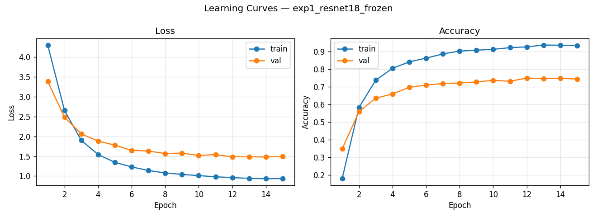
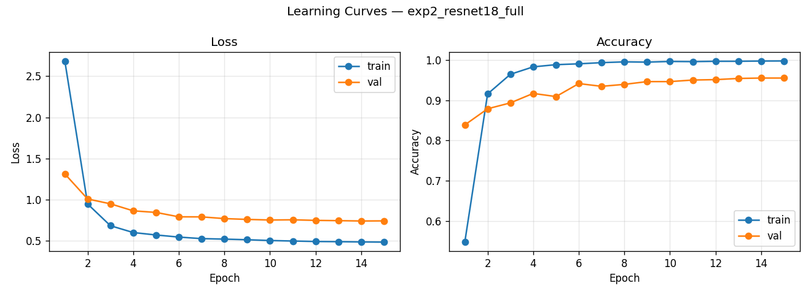
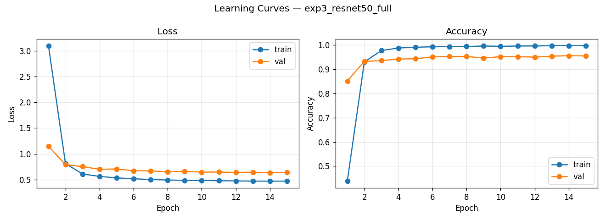
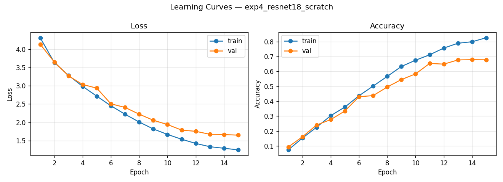
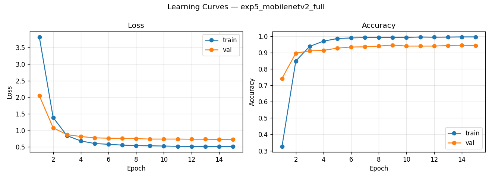
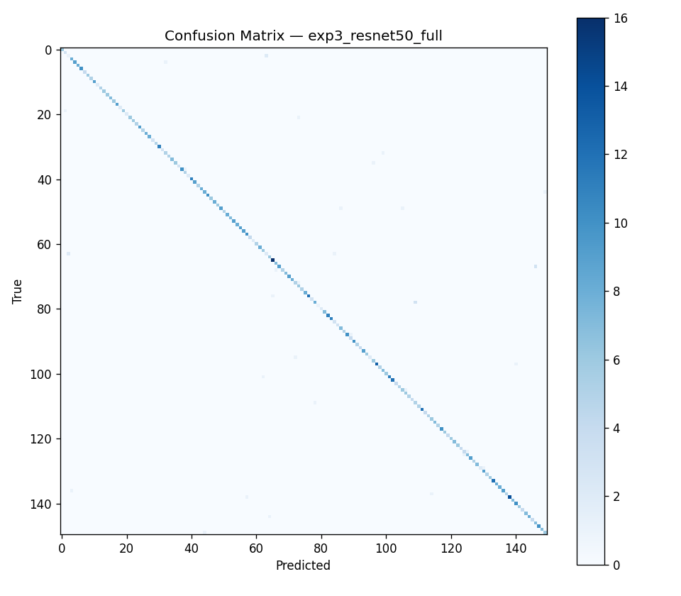

# 포켓몬 이미지 분류 (전이 학습)

ImageNet에 미리 학습된 CNN을 가져다가 포켓몬 데이터로 다시 학습시켜서, 사진 한 장만 있으면 어떤 포켓몬인지 맞추도록 만들어 본 PyTorch 프로젝트입니다.

그냥 모델 하나 돌려보고 끝내는 게 아니라, **사전 학습이 정말 도움이 되는지**, **어디까지 파인튜닝해야 하는지**, **모델 크기를 키우면 얼마나 좋아지는지** 같은 것들을 직접 비교해보고 싶어서 다섯 가지 설정을 따로 돌려봤습니다. 학습이 끝나면 Streamlit으로 만든 작은 데모 페이지에서 이미지를 올려 Top-K 결과를 바로 확인해볼 수 있습니다.


> 아래 표·곡선·혼동행렬은 모두 RTX 5080에서 5개 실험을 15 epoch씩 실제로
> 학습시킨 결과입니다 (`results/summary.json` 기준). 같은 시드(`--seed 42`)에서는
> 동일한 수치가 재현됩니다.

---

## 뭘 할 수 있나요

- 다섯 가지 실험 설정으로 전이 학습의 효과를 하나씩 뜯어볼 수 있습니다
- 백본은 **ResNet18 / ResNet50 / MobileNetV2** 세 가지 (EfficientNet-B0도 추가하기 쉽게 만들어 뒀습니다)
- 학습 방식은 **백본 고정 / 전체 파인튜닝 / 처음부터 학습** 중에서 고를 수 있어요
- 실험을 돌리면 최고 성능 체크포인트, 학습 곡선, 혼동 행렬, 그리고 accuracy · top-5 · macro/weighted precision · recall · F1까지 정리된 JSON이 자동으로 떨어집니다
- 단일 이미지 추론용 Streamlit 데모 GUI 포함
- 시드를 고정해두고 train/val/test 분할이랑 평가 transform도 결정적으로 해놨기 때문에 같은 조건이면 결과가 다시 나옵니다

---

## 폴더 구조

```text
pokemon_classification/
├── README.md
├── requirements.txt
├── app.py                       # Streamlit 데모
├── src/
│   ├── dataset.py               # ImageFolder + train/val/test 분할
│   ├── model.py                 # 백본 만들어주는 팩토리
│   ├── train.py                 # 학습 진입점
│   ├── evaluate.py              # 테스트 지표 계산
│   ├── predict.py               # 단일 이미지 추론
│   └── utils.py                 # 시각화·시드·입출력 유틸
├── experiments/
│   ├── configs.py               # 다섯 가지 실험 정의
│   └── run_all.py               # 전부 돌리고 요약 만들기
├── scripts/
│   └── make_demo_assets.py      # README용 비교 그래프 생성 (summary.json 기반)
├── results/                     # 학습 후 자동 생성
│   ├── learning_curves/
│   ├── confusion_matrices/
│   ├── metrics/
│   ├── summary.json
│   └── summary.md
├── checkpoints/                 # 실험별 베스트 모델
└── assets/                      # README용 비교 그래프
```

---

## 설치

```bash
python -m venv .venv
.venv\Scripts\activate            # Windows PowerShell
pip install -r requirements.txt
```

GPU가 있으면 훨씬 편하지만 꼭 필요한 건 아닙니다. 코드에서 CUDA 사용 가능한지 알아서 확인하고, 없으면 그냥 CPU로 돌아가요.

### 데이터셋 준비

Kaggle의 **7,000 Labeled Pokemon** 데이터셋을 받아서 씁니다.

<https://www.kaggle.com/datasets/lantian773030/pokemonclassification>

압축을 풀면 클래스별 폴더로 나뉘어 있는데, 그대로 아래처럼 두면 됩니다.

```text
data/PokemonData/
├── Abra/
│   ├── 00000001.jpg
│   ├── ...
├── Aerodactyl/
├── ...
└── Zubat/                       # 총 150개 클래스
```

경로는 `--data-dir`로 원하는 위치를 넘겨주면 됩니다.

---

## 학습 돌리기

실험 하나만 돌려보고 싶다면:

```powershell
python -m src.train --data-dir data/PokemonData --backbone resnet18 `
    --mode full_finetune --epochs 15 --tag exp2_resnet18_full
```

다섯 개 한 번에 다 돌리고 비교 표까지 만들고 싶다면:

```powershell
python -m experiments.run_all --data-dir data/PokemonData
```

결과물은 이렇게 떨어집니다.

| 경로 | 내용 |
|---|---|
| `checkpoints/{tag}.pth` | 검증 정확도 기준 베스트 가중치 + 클래스 이름 |
| `results/learning_curves/{tag}.png` | epoch별 loss / accuracy 곡선 |
| `results/confusion_matrices/{tag}.png` | 테스트 세트 혼동 행렬 |
| `results/metrics/{tag}.json` | 실험별 전체 지표와 epoch 기록 |
| `results/summary.{json,md}` | 모든 실험 비교한 요약 |

---

## 데모 GUI (Streamlit)

체크포인트가 있어야 데모를 돌릴 수 있으니까, 일단 실험을 한 번이라도 돌려두고 시작합니다.

```powershell
streamlit run app.py
```

켜진 앱에서 `checkpoints/` 안에 있는 모델 중 하나를 고르고 이미지를 올리면, Top-K 예측 결과를 막대그래프와 순위 목록으로 보여줍니다. 이미지는 파일을 끌어다 놓아도 되고, **클립보드에 복사한 이미지를 "📋 클립보드에서 붙여넣기" 버튼으로 바로 붙여넣어도** 됩니다.


https://github.com/user-attachments/assets/1294daac-e8ed-41c2-adc5-29304f8c105a


---

## 실험 구성

| ID | 백본 | 모드 | 보고 싶은 것 |
|---|---|---|---|
| **exp1** | ResNet18 | feature_extract (백본 고정) | 사전 학습 특징만으로도 충분할까? |
| **exp2** | ResNet18 | 전체 파인튜닝 | 사전 학습 + 전체 파인튜닝의 기본 성능 |
| **exp3** | ResNet50 | 전체 파인튜닝 | 모델을 키우면 얼마나 좋아질까? |
| **exp4** | ResNet18 | 처음부터 학습 | ImageNet 사전 학습이 진짜 도움이 되는 걸까? |
| **exp5** | MobileNetV2 | 전체 파인튜닝 | 가벼운 모델이 ResNet18 만큼 따라잡을 수 있을까? |

이렇게 짠 이유는 한 번에 하나씩만 다르게 해서 비교하고 싶어서였습니다.

- **사전 학습 효과**: exp4 vs. exp2 (구조는 같고 초기화만 다름)
- **파인튜닝 범위**: exp1 vs. exp2 (분류기만 학습 vs. 전체 학습)
- **모델 용량**: exp2 vs. exp3 (작은 ResNet vs. 큰 ResNet)
- **아키텍처 계열**: exp2 vs. exp5 (residual vs. inverted residual)

### 실험 결과

5개 실험을 RTX 5080(CUDA 12.8)에서 각각 15 epoch씩 학습했습니다. test 세트 1,023장 기준이고, 정확한 수치는 `results/summary.json` / `results/summary.md`에 그대로 들어 있습니다.

| Tag | 백본 | 모드 | Test Acc | Top-5 | Precision (macro) | Recall (macro) | F1 (macro) |
|---|---|---|---|---|---|---|---|
| exp1_resnet18_frozen   | ResNet18    | feature_extract | 0.7713 | 0.9326 | 0.7900 | 0.7822 | 0.7664 |
| exp2_resnet18_full     | ResNet18    | full fine-tune  | 0.9492 | 0.9892 | 0.9510 | 0.9522 | 0.9478 |
| exp3_resnet50_full     | ResNet50    | full fine-tune  | **0.9638** | **0.9951** | **0.9622** | **0.9639** | **0.9609** |
| exp4_resnet18_scratch  | ResNet18    | from scratch    | 0.6872 | 0.9091 | 0.6949 | 0.6922 | 0.6698 |
| exp5_mobilenetv2_full  | MobileNetV2 | full fine-tune  | 0.9462 | 0.9922 | 0.9509 | 0.9500 | 0.9452 |


### 학습 곡선

| | |
|---|---|
|  |  |
|  |  |
|  | |

### 혼동 행렬

가장 성능이 좋은 **exp3_resnet50_full** (test acc 96.4%)의 혼동 행렬입니다.
나머지 실험의 혼동 행렬은 `results/confusion_matrices/` 아래에 모두 있습니다.



### 돌려보고 느낀 점

- **사전 학습 효과가 가장 큰 변수였습니다.** 같은 ResNet18인데 처음부터 학습한 exp4(test acc **0.6872**)와 ImageNet 가중치에서 출발해 전체를 파인튜닝한 exp2(**0.9492**) 사이에 약 26%p 차이가 났습니다. 7천 장 / 150 클래스 규모에서 사전 학습 없이 95%대를 노리긴 어렵다는 게 그대로 보였습니다.
- **백본을 고정하는 것보단 전체를 학습시키는 게 낫습니다.** 분류기만 학습한 exp1(**0.7713**)이 전체 파인튜닝 exp2(**0.9492**)에 약 18%p 밀렸습니다. 포켓몬 이미지가 ImageNet 사진들과 결이 달라서, 백본 특징을 그대로 쓰는 것만으로는 한계가 분명했습니다.
- **모델을 키우는 효과는 생각보단 작았습니다.** ResNet50(exp3, **0.9638**)이 ResNet18(exp2, **0.9492**)보다 약 1.5%p 정도 좋아지는 데 그쳤고, 학습 시간은 더 걸렸습니다 (5.1분 → 7.2분). 이 정도 데이터셋 규모에서는 백본 크기를 키우는 한계 효용이 빠르게 떨어졌습니다.
- **MobileNetV2가 의외로 쓸 만했습니다.** exp5(**0.9462**)는 ResNet18(exp2, **0.9492**)와 거의 동일한 성능을 학습 파라미터 1/5(2.4M vs 11.3M)로 달성했습니다. 추론 속도나 모델 크기가 중요한 환경이면 충분히 후보가 될 것 같습니다.

---

## 재현성

- 기본 시드는 `--seed 42`이고, `random` / `numpy` / `torch`에 다 적용됩니다.
- train/val/test는 70/15/15로 나누는데, 시드만 같으면 항상 같은 분할이 나옵니다.
- 평가 단계 transform에는 무작위 증강이 들어가지 않습니다.
- Windows에서 가끔 말썽인 워커 문제 때문에 `num_workers=0`을 기본으로 두고 있습니다. Linux에서 돌릴 때는 늘려서 쓰시면 더 빠릅니다.

---

## 사용한 것들

- PyTorch 2.x · torchvision · scikit-learn (지표 계산용) · matplotlib / seaborn
- GUI는 Streamlit
- 작업 환경은 Python 3.10 ~ 3.13, Windows 11

---

## 출처

- 데이터셋: [7,000 Labeled Pokemon](https://www.kaggle.com/datasets/lantian773030/pokemonclassification) (Kaggle)
- 사전 학습 가중치: `torchvision.models`의 ImageNet-1k 가중치
